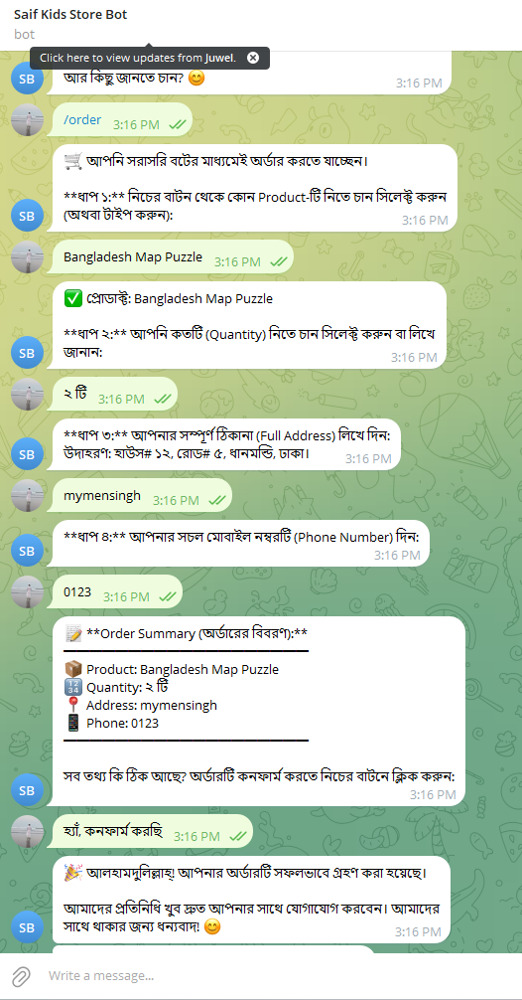

# 🤖 Telegram AI Store Assistant

An AI-powered Telegram bot that helps customers get product information, place orders, and automatically notifies the store admin about new orders.

Built with Python, Anthropic Claude API, and Telegram Bot API.

## ✨ Features

- 🤖 AI-powered customer support
- 📦 Product information lookup
- 🚚 Delivery information
- 🔄 Return policy assistance
- 🛒 Order placement through Telegram
- 🔔 Automatic admin order notifications
- 💬 Natural language conversation
- 🔐 Environment variable support

## 🛠️ Tech Stack

- Python
- Anthropic Claude API
- Telegram Bot API
- python-dotenv
---

## ⚙️ How It Works

```text
Customer
     │
     ▼
Telegram Bot
     │
     ▼
AI Assistant (Claude)
     │
     ├── Product Information
     ├── Delivery Information
     ├── Return Policy
     └── Order Collection
     │
     ▼
Admin Notification
```

---

## 📂 Project Structure

```
telegram-ai-store-assistant/
│
├── main.py                # Main Telegram bot application
├── .env.example           # Environment variables template
├── requirements.txt       # Project dependencies
├── .gitignore
│
└── assets/
    └── demo.png           # Demo screenshot
```
---

## 🚀 Installation

### 1. Clone the repository

```bash
git clone https://github.com/saifyea/telegram-ai-store-assistant.git
cd telegram-ai-store-assistant
```

### 2. Install dependencies

```bash
pip install -r requirements.txt
```

### 3. Configure environment variables

Rename `.env.example` to `.env` and add your API keys:

```env
ANTHROPIC_API_KEY=your_api_key
TELEGRAM_BOT_TOKEN=your_bot_token
ADMIN_CHAT_ID=your_admin_chat_id
```

### 4. Run the bot

```bash
python main.py
```
---

## 💼 Business Use Case

This project demonstrates how AI can improve customer support and automate order management for small businesses.

### Example Use Cases

- 🛍️ Online stores
- 🎁 Facebook (F-commerce) businesses
- 📚 Educational product sellers
- 🍽️ Food delivery businesses
- 🏪 Small retail shops

The bot can answer customer questions, collect orders, and instantly notify the business owner through Telegram.
---
## 📸 Demo

Example conversation with the AI assistant:



✅ Automatic admin notification when a customer places an order

### ⭐ Key Capability

- AI-powered customer support
- Telegram-based order placement
- Instant admin notification for every new order

## 🔮 Future Improvements

- Multi-language support
- Product catalog management
- Payment integration
- Customer order history
- Web admin dashboard

## 📄 License

This project is created for educational and portfolio purposes.
